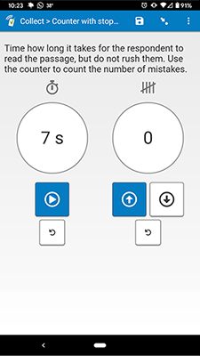

# Counter with stopwatch

## Description

*Requires at least Android 7 or iOS 13 to work in SurveyCTO Collect mobile.*

Use this field plug-in to add a stopwatch and a counter to your field. The stopwatch can display the elapsed time in seconds, deciseconds, centiseconds, and milliseconds. The counter can keep track of the number of occurrences of something. You can reset the current value of either the stopwatch, or the counter, or both.

This field plug-in also inherits functionality from the [baseline-text](https://github.com/surveycto/baseline-text) field plug-in.

### Feature list

* Stopwatch for keeping track of time passed
* Button to start and pause stopwatch as needed
* Button to increase counter value, and button to decrease value (cannot go below 0)
* Button to reset stopwatch
* Button to reset counter
* Warning when about to reset the counter or stopwatch
* Customization of unit for stopwatch

### Data format

Both the count and the time passed are stored in a space-separated list:

    [count] [time (in ms)]

For example, if the count is set to 3, and the stopwatch is stopped at 10,364 milliseconds, the field will have this value:

    3 10364

The time is always saved in milliseconds, even if the display is set to another unit. They can be retrieved in your SurveyCTO form using the item-at() function.

An answer is not set until the stopwatch is stopped. The value is re-stored whenever the stopwatch is stopped, or when the counter value is changed while the stopwatch is stopped. The enumerator/respondent can come back and continue where they left off with the same amount of time passed and the same count value. For example, if the enumerator leaves the field with 5 seconds passed, when they return, the stopwatch will still say 5 seconds have passed.

## How to use

### Getting started

**To use this field plug-in as-is:**

1. Download the [sample form](extras/sample-form) from this repo and upload it to your SurveyCTO server.
1. Download the [counterwithstopwatch.fieldplugin.zip](https://github.com/surveycto/counter-with-stopwatch/raw/master/counterwithstopwatch.fieldplugin.zip) file from this repo, and attach it to the sample form on your SurveyCTO server.
1. Adjust the parameter if you would like to use a different unit (see below).

### Parameters

| Key | Value |
| --- | --- |
| `time-unit` (optional) | This is the unit of time measurement that will be displayed. Possible values are `s` (for seconds), `ds` (for deciseconds), `cs` (for centiseconds), or `ms` (for milliseconds).|

If no parameters are supplied, seconds will be shown by default.  Make sure the unit is in single quotes, like this:

    custom-counter-with-stopwatch(time-unit='cs')

### Default SurveyCTO feature support

| Feature / Property | Support |
| --- | --- |
| Supported field type(s) | `text`|
| Default values | Yes |
| Custom constraint message | No |
| Custom required message | No |
| Read only | No |
| media:image | Yes |
| media:audio | Yes |
| media:video | Yes |
| `number` appearance | No |
| `numbers_decimal` appearance | No |
| `numbers_phone` appearance | No |
| `show_formatted` appearance | No |

## More resources

* **Sample form**  
[extras/sample-form](extras/sample-form)
* **Developer documentation**  
Instructions and resources for developing your own field plug-ins.  
[https://github.com/surveycto/Field-plug-in-resources](https://github.com/surveycto/Field-plug-in-resources)
* **User documentation**  
How to get started using field plug-ins in your SurveyCTO form.  
[https://docs.surveycto.com/02-designing-forms/03-advanced-topics/06.using-field-plug-ins.html](https://docs.surveycto.com/02-designing-forms/03-advanced-topics/06.using-field-plug-ins.html)