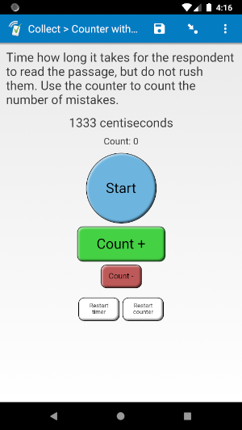
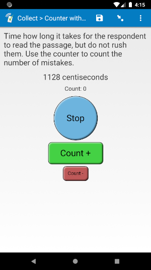

# Stopwatch with counter (in alpha)

<!--
||||
|:---:|:---:|:---:|
|Running|Warning|Ended|-->

*This plug-in is currently being tested, but has so far worked well.*

## Description

Use this plug-in to add a stopwatch to your field. It also includes a counter you can use to keep track of something while timing, with buttons to both count up and count down. You can use it to count words read, number of mistakes, or whatever else you need to count. The count will never go below 0.

If an enumerator uses one of the restart buttons, they will have to confirm the restart. These buttons only appear when the timer is not running.

An answer is not set until the stopwatch is stopped. The value is re-stored whenever the timer is stopped, or when the counter value is changed while the stopwatch is stopped. They can come back and continue where they left off with the same amount of time passed and the same count value.

The value this plug-in returns is a space-separated list:

0. The count on the counter
1. The time that has passed on the stopwatch in milliseconds.

You can use the `selected-at()` function in order to get each individual value. For example, if the field is called "timer1", you can use this expression to get the counter value:

    selected-at(${stopwatch1}, 0)

## Default SurveyCTO feature support

| Feature / Property | Support |
| --- | --- |
| Supported field type(s) | `text`|
| Default values | Yes |
| Custom constraint message | No |
| Custom required message | No |
| Read only | No |
| media:image | Yes |
| media:audio | Yes |
| media:video | Yes |
| `number` appearance | No |
| `numbers_decimal` appearance | No |
| `numbers_phone` appearance | No |
| `show_formatted` appearance | No |

## How to use

**To use this plug-in as-is**, just download the [counterwithstopwatch.fieldplugin.zip](counterwithstopwatch.fieldplugin.zip) file from this repo, and attach it to your form.

To create your own field plug-in using this as a template, follow these steps:

1. Fork this repo
1. Make changes to the files in the `source` directory.

    * **Note:** be sure to update the `manifest.json` file as well.

1. Zip the updated contents of the `source` directory.
1. Rename the .zip file to *yourpluginname*.fieldplugin.zip (replace *yourpluginname* with the name you want to use for your plug-in).
1. You may then attach your new .fieldplugin.zip file to your form as normal.

## Parameters

This field takes one parameters: the sisplay unit. If no unit is specified, it will display the time in seconds. If no parameters are specified, it will default to "seconds".

You can use the following display units:  
|**Abbr.**|**Full name**|**Unit in 1 second**|
|:---|:---|:---|
|`s`|seconds|1
|`ds`|deciseconds|10
|`cs`|centiseconds|100
|`ms`|milliseconds|1000

For example, if you use the following *appearance*:

    custom-counterwithstopwatch(unit='cs')

This will display the time in centiseconds.

## More resources

* **Test form**  
You can find a form definition in this repo here: [extras/test-form](extras/test-form).

* **Developer documentation**  
More instructions for developing and using field plug-ins can be found here: [https://github.com/surveycto/Field-plug-in-resources](https://github.com/surveycto/Field-plug-in-resources)